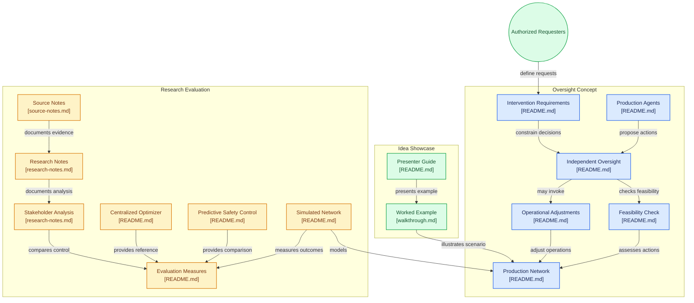

# Project Diagram

Conceptual overview of the proposed system, research evaluation, and showcase materials.

```mermaid
%% Generated by https://gitdiagram.com/siriacid/right-to-intervene
flowchart TD

subgraph group_oversight["Oversight Concept"]
  node_production_agents["Production Agents<br/>[README.md]"]
  node_production_network["Production Network<br/>[README.md]"]
  node_intervention_requirements["Intervention Requirements<br/>[README.md]"]
  node_oversight_layer["Independent Oversight<br/>[README.md]"]
  node_feasibility_check["Feasibility Check<br/>[README.md]"]
  node_operational_adjustments["Operational Adjustments<br/>[README.md]"]
end

subgraph group_research["Research Evaluation"]
  node_simulation["Simulated Network<br/>[README.md]"]
  node_stakeholder_analysis["Stakeholder Analysis<br/>[research-notes.md]"]
  node_evaluation["Evaluation Measures<br/>[README.md]"]
  node_predictive_control["Predictive Safety Control<br/>[README.md]"]
  node_centralized_optimizer["Centralized Optimizer<br/>[README.md]"]
  node_research_notes["Research Notes<br/>[research-notes.md]"]
  node_source_notes["Source Notes<br/>[source-notes.md]"]
end

subgraph group_communication["Idea Showcase"]
  node_worked_example["Worked Example<br/>[walkthrough.md]"]
  node_presenter_guide["Presenter Guide<br/>[README.md]"]
end

node_authorized_requesters(("Authorized Requesters"))

node_production_agents -->|"propose actions"| node_oversight_layer
node_intervention_requirements -->|"constrain decisions"| node_oversight_layer
node_authorized_requesters -->|"define requests"| node_intervention_requirements
node_oversight_layer -->|"checks feasibility"| node_feasibility_check
node_feasibility_check -->|"assesses actions"| node_production_network
node_oversight_layer -->|"may invoke"| node_operational_adjustments
node_operational_adjustments -->|"adjust operations"| node_production_network
node_simulation -->|"models"| node_production_network
node_simulation -->|"measures outcomes"| node_evaluation
node_predictive_control -->|"provides comparison"| node_evaluation
node_centralized_optimizer -->|"provides reference"| node_evaluation
node_stakeholder_analysis -->|"compares control"| node_evaluation
node_worked_example -->|"illustrates scenario"| node_production_network
node_presenter_guide -->|"presents example"| node_worked_example
node_research_notes -->|"documents analysis"| node_stakeholder_analysis
node_source_notes -->|"documents evidence"| node_research_notes

click node_production_agents "https://github.com/siriacid/right-to-intervene/blob/main/README.md"
click node_production_network "https://github.com/siriacid/right-to-intervene/blob/main/README.md"
click node_intervention_requirements "https://github.com/siriacid/right-to-intervene/blob/main/README.md"
click node_oversight_layer "https://github.com/siriacid/right-to-intervene/blob/main/README.md"
click node_feasibility_check "https://github.com/siriacid/right-to-intervene/blob/main/README.md"
click node_operational_adjustments "https://github.com/siriacid/right-to-intervene/blob/main/README.md"
click node_simulation "https://github.com/siriacid/right-to-intervene/blob/main/README.md"
click node_stakeholder_analysis "https://github.com/siriacid/right-to-intervene/blob/main/docs/research-notes.md"
click node_evaluation "https://github.com/siriacid/right-to-intervene/blob/main/README.md"
click node_predictive_control "https://github.com/siriacid/right-to-intervene/blob/main/README.md"
click node_centralized_optimizer "https://github.com/siriacid/right-to-intervene/blob/main/README.md"
click node_worked_example "https://github.com/siriacid/right-to-intervene/blob/main/showcase/walkthrough.md"
click node_presenter_guide "https://github.com/siriacid/right-to-intervene/blob/main/showcase/README.md"
click node_research_notes "https://github.com/siriacid/right-to-intervene/blob/main/docs/research-notes.md"
click node_source_notes "https://github.com/siriacid/right-to-intervene/blob/main/docs/source-notes.md"

classDef toneNeutral fill:#f8fafc,stroke:#334155,stroke-width:1.5px,color:#0f172a
classDef toneBlue fill:#dbeafe,stroke:#2563eb,stroke-width:1.5px,color:#172554
classDef toneAmber fill:#fef3c7,stroke:#d97706,stroke-width:1.5px,color:#78350f
classDef toneMint fill:#dcfce7,stroke:#16a34a,stroke-width:1.5px,color:#14532d
classDef toneRose fill:#ffe4e6,stroke:#e11d48,stroke-width:1.5px,color:#881337
classDef toneIndigo fill:#e0e7ff,stroke:#4f46e5,stroke-width:1.5px,color:#312e81
classDef toneTeal fill:#ccfbf1,stroke:#0f766e,stroke-width:1.5px,color:#134e4a
class node_production_agents,node_production_network,node_intervention_requirements,node_oversight_layer,node_feasibility_check,node_operational_adjustments toneBlue
class node_simulation,node_stakeholder_analysis,node_evaluation,node_predictive_control,node_centralized_optimizer,node_research_notes,node_source_notes toneAmber
class node_worked_example,node_presenter_guide,node_authorized_requesters toneMint
```
